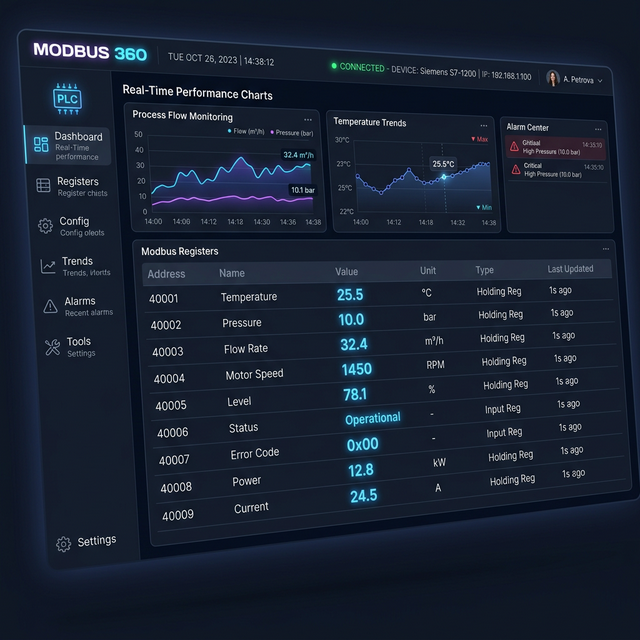

# MODBUS 360 - The Ultimate Industrial Modbus Client



[](https://github.com/lunasoft-llc/modbus360/releases)
[](https://dotnet.microsoft.com/download)
[](https://github.com/lunasoft-llc/modbus360/releases)

---

**MODBUS 360** is a high-performance, Native AOT compiled industrial utility designed for real-time data monitoring and control. Engineered for low latency and high-stress environments, it provides engineers with a seamless way to visualize and interact with Modbus devices.

## ✨ Key Features

### 🚀 Performance & Core
- **Native AOT Compilation**: Blazing fast startup and ultra-low memory footprint (<50MB).
- **Multi-Protocol Support**: Full support for **Modbus TCP/IP**, **Modbus RTU (Serial)**, and **RTU over TCP**.
- **Low Latency Engine**: Optimized for high-frequency polling with smart register grouping.
- **Cross-Platform**: Native builds for Windows (x64), Linux (x64/arm64), and macOS (Apple Silicon/Intel).

### 📊 Advanced Value Scaling
Transform raw register values into meaningful engineering units using our built-in scaling engine:
- **Formula**: `Scaled Value = (Raw Value × Multiplier) + Offset`
- **Use Cases**: Degree Celsius conversion, Pressure scaling, Flow rate calculation.
- **Precision Control**: Configurable decimal places for clean data visualization.

### 🎨 Next-Gen User Interface
- **Premium Aesthetics**: Clean, modern dark theme with acrylic blur and glassmorphism.
- **Custom Dashboard**: Create personalized layouts with visual indicators and action buttons.
- **Live Charts**: Real-time trend visualization powered by LiveCharts 2.0.
- **Interactive DataGrid**:
    - **Resizable Columns**: Customize your view by dragging column borders.
    - **Smart Tooltips**: Instant help on every column (Addresses, Types, Formulas).
    - **Hex/Decimal Toggle**: Switch between raw communication and processed data seamlessly.

### 🔍 Discovery & Diagnostics
- **Network Scanner**: Deep discovery of active registers across address ranges.
- **Device Finder**: Automatically detect slave IDs (1-247) on your network.
- **Traffic Sniffer**: Monitor low-level packet communication for troubleshooting.
- **Profile Management**: Save and load complex device configurations instantly.

## 📦 Installation

### Windows (Recommended)
Download and run the **[Modbus360_Setup.exe](https://github.com/lunasoft-llc/modbus360/releases)** for a professional installation experience with a desktop shortcut and administrative register control.

### Portable Versions
We provide portable `.zip` archives for Windows, Linux, and macOS. Simply download, extract, and run—no dependencies required (Native AOT).

- [Latest Releases](https://github.com/lunasoft-llc/modbus360/releases)

### macOS App and DMG

The macOS workflow produces separate packages for Apple Silicon and Intel:

- `Modbus360-macOS-Apple-Silicon-*.dmg`
- `Modbus360-macOS-Intel-*.dmg`

Open the correct DMG and drag `Modbus360.app` to Applications. Current packages
are unsigned, so on first launch Control-click the app and choose **Open**.

Maintainers can create the packages on macOS with:

```bash
chmod +x ./build-osx.sh
./build-osx.sh --version 1.2.9
```

The **Build macOS App and DMG** GitHub Actions workflow creates the same files
as downloadable workflow artifacts.

## 🛠️ Technical Stack

- **Framework**: .NET 9.0 (Native AOT)
- **UI Architecture**: Avalonia UI 11.3 (MVVM)
- **Communication**: FluentModbus 5.3
- **Visualization**: LiveChartsCore 2.0
- **UI Logic**: CommunityToolkit.Mvvm

## 📞 Support

**Developed by**: [LUNASOFT INDUSTRIAL SYSTEMS](https://www.lunasoft.az)  
**Location**: Baku, Azerbaijan  
**Email**: [support@lunasoft.az](mailto:support@lunasoft.az)

---

© 2024-2025 **LUNASOFT INDUSTRIAL SYSTEMS**. All rights reserved.
Protected under Proprietary License.
