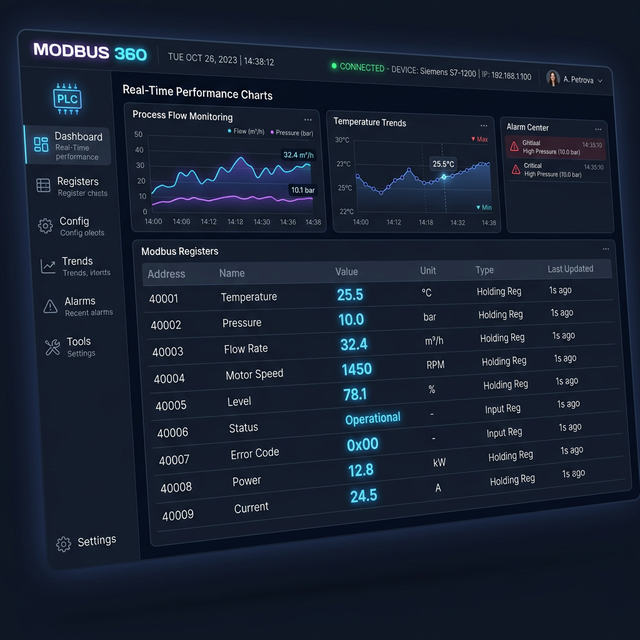

# MODBUS 360 — Industrial Modbus Client



[](https://github.com/lunasoft-llc/modbus360/releases)
[](https://dotnet.microsoft.com/download)
[](https://github.com/lunasoft-llc/modbus360/releases)

MODBUS 360 is a cross-platform tool for monitoring, testing, visualizing, and controlling Modbus devices.

## Key features

### Connections and sessions

- Modbus TCP/IP, Modbus RTU (serial), and Modbus RTU over TCP.
- Parallel, isolated device sessions through **New Session**.
- Editable IP history with recently used addresses shown first.
- Automatic restoration of the last successful connection:
  - transport, IP address, and port;
  - COM port and baud rate;
  - data bits, parity, stop bits, and flow control;
  - Unit ID, connection timeout, and poll interval.
- Automatic system COM-port discovery with manual entry support.
- Configurable TCP connection timeout and polling interval.

> Modbus ASCII and Modbus UDP are not currently supported.

### Register polling

- Smart contiguous block polling: adjacent registers are read in a single Modbus request.
- Correct word counts for 16-bit, 32-bit, float, and double values.
- Holding Registers, Input Registers, Coils, and Discrete Inputs.
- On first connection to a new IP, addresses `0–9` are created automatically.
- Register configuration is stored per IP and restored on the next connection.
- Editable address, name, register type, data type, multiplier, offset, and unit.
- Single and multiple register/coil writes using FC05, FC06, FC15, and FC16.
- FC23 Read/Write Multiple Registers support in the service layer.
- Correct Modbus Big Endian handling for RTU and RTU-over-TCP.

### Data representation

- Int16, UInt16, Int32, UInt32, Float, Double, Boolean, and Hex.
- Scaling formula: `Scaled Value = (Raw Value × Multiplier) + Offset`.
- Configurable byte/word order: ABCD, CDAB, BADC, and DCBA.
- Raw hexadecimal and converted values displayed together.

### Test and diagnostics

- Raw Modbus TCP **Test Center** for complete MBAP + PDU hexadecimal frames.
- MBAP length and hexadecimal input validation.
- TX/RX response display with configurable timeout.
- Traffic sniffer and CSV logging/export.
- Address Scanner and Unit ID Device Finder.
- Quick Write commands.
- Real-time charts and connection performance information.

### Dashboard and server mode

- Custom dashboards with live values and write-action buttons.
- Drag, resize, grid snap, named layouts, and `.m360` import/export.
- Modbus TCP slave/server mode with Coils, Discrete Inputs, Input Registers, and Holding Registers.
- Live client count, write synchronization, and server traffic log.

## Installation

### Windows

Download the latest installer or portable ZIP from [GitHub Releases](https://github.com/lunasoft-llc/modbus360/releases).

### Linux

Download the self-contained Linux archive from GitHub Releases. Preserve executable permissions when extracting.

### macOS

Separate bundles are produced for Apple Silicon and Intel:

- `Modbus360-macOS-Apple-Silicon-*.dmg`
- `Modbus360-macOS-Apple-Silicon-*.zip`
- `Modbus360-macOS-Intel-*.dmg`
- `Modbus360-macOS-Intel-*.zip`

The ZIP files contain the complete `Modbus360.app` bundle. No separate .NET runtime is required.

To install from a DMG, drag `Modbus360.app` to Applications. Current packages are ad-hoc signed but not Apple-notarized. If Gatekeeper blocks the first launch:

```bash
xattr -cr /Applications/Modbus360.app
```

Then Control-click the app and choose **Open**.

Maintainers can package both architectures on macOS:

```bash
chmod +x ./build-osx.sh
./build-osx.sh --version 1.2.13 --output publish/osx
```

The **Build macOS App and DMG** GitHub Actions workflow generates the same DMG, ZIP, and SHA-256 artifacts. When `distribute.ps1` runs on Windows, it waits for the tag-triggered macOS workflow, downloads those artifacts, and includes them in the public distribution.

## Build

```bash
dotnet restore MODBUS360.sln
dotnet build MODBUS360.sln -c Release
dotnet test MODBUS360.sln -c Release
```

Platform packaging scripts:

- Windows: `build-win.ps1`
- Linux: `build-linux.ps1`
- macOS: `build-osx.sh`

## Technology

- .NET 9
- Avalonia UI 11.3
- CommunityToolkit.Mvvm
- FluentModbus 5.3
- LiveChartsCore 2

## Support

Developed by [LUNASOFT INDUSTRIAL SYSTEMS](https://www.lunasoft.az), Baku, Azerbaijan.

Email: [support@lunasoft.az](mailto:support@lunasoft.az)

© 2024–2026 LUNASOFT INDUSTRIAL SYSTEMS. All rights reserved.
